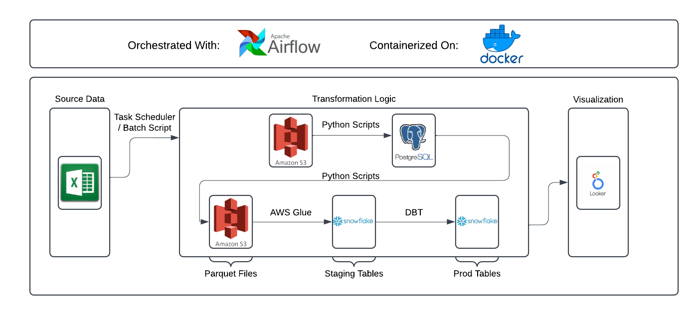

# Weight Lifting Data Pipeline

## Overview
This repository contains a personal project that is  designed to enhance my skills / gain exposure in data engineering. My goal with this pipeline is to pull all of my weightlifting data, which is tracked with excel on my phone, into a visualization tool to gain insights on my training and track my progress. 

> [!IMPORTANT]
> Many architectual choices in this project are not optimal / are overkill. These choices are intentional and are here to gain exeprience with more tools + concepts.

## Infrastructure  

### Tools & Services  

| Service       | Badge                                                                                     |  
|---------------|-------------------------------------------------------------------------------------------|  
| AWS S3        |    |  
| Apache Airflow|  |  
| Docker        |       |  
| AWS Glue      |  |  
| dbt           |               |  
| Looker        |       |  

### Databases  

| Database       | Badge                                                                                     |  
|----------------|-------------------------------------------------------------------------------------------|  
| PostgreSQL     |  |  
| Snowflake      |    |  

## Pipelines 

### Section In Progress!!

## Roadmap of Updates

### Section In Progress!!
